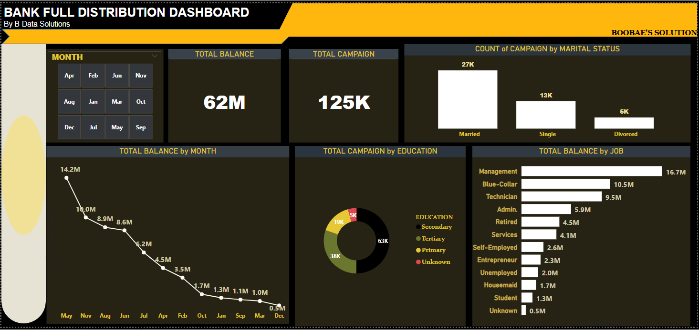

# DASHBOARD-DEVELOPMENT
**COMPANY**: CODETECH IT SOLUTIONS

**NAME**: SMRITI KAUSHIK

**INTERN ID**: CT08JGJ

**DOMAIN**: DATA ANALYTICS

**BATCH DURATION**: JAN 5TH,2025 TO FEB 5TH,2025

**MENTOR NAME**: Neela Santhosh Kumar 

DESCRIPTION : A dashboard is like a summary of important information presented in one place through key metrics and visuals. In Power BI, users can combine various visuals like charts, tables, and KPIs on a single canvas. This allows them to customize and arrange visuals for a focused view of relevant data, making monitoring and decision-making easier. Dashboards are interactive, letting users drill down into details or apply filters for deeper analysis.

In the banking world, the demand for insightful data analysis is crucial. To meet this need, we're developing a tracking dashboard for a bank using the 'Bank Full Distribution' dataset. This dynamic dashboard aims to provide actionable insights by highlighting two essential Key Performance Indicators (KPIs): total balance and total campaign. We'll analyze campaign counts by marital status, track monthly changes in total balance, examine campaign performance based on education, and explore shifts in total balance across different job categories. To simplify user experience, we'll add a month slicer feature, making it easy for users to choose specific months. This user-friendly tool will offer the bank a clear view of its performance, helping in better decision-making.

## PROBLEM STATEMENT 

1. Create two Key Performance Indicators (KPIs):
   - Total balance
   - Total campaign
2. Analyze campaign count based on marital status
3. 3. Categorize total balance by month
4. Segment total campaign by education
5. Segment total balance by job
6. Incorporate a month slicer feature into the dashboard

## SKILLS AND CONCEPTS TO BE DEMONSTRATED

Developing a tracking dashboard for a bank, utilizing the 'Bank Full Distribution' dataset involves a combination of technical skills, data analysis, and non-technical skills. Here are the skills and concepts to be demonstrated in this task:

1. Dashboard Design and Development:
   - Skills: Proficiency in using dashboard development tools (e.g. Power BI) to create visually appealing and user-friendly interfaces.
   - Concepts: Principles of effective dashboard design, including layout, color choice, and user interaction.
2. Key Performance Indicators (KPIs):
   - Skills: Creating and implementing KPIs such as total balance and total campaign.
   - Concepts: Understanding of key metrics relevant to the banking domain.
3. Data Analysis and Segmentation:
   - Skills: Analyzing campaign counts and total balances based on different parameters (marital status, month, education, job).
   - Concepts: Segmentation techniques and their application in financial data analysis.
4. Month Slicer Feature:
   - Skills: Implementing interactive features like a month slicer for user-controlled data exploration.
   - Concepts: Enhancing user experience through interactive elements in data visualization.
5. Communication Skills:
   - Skills: Clearly articulating the objectives, methods, and outcomes of the task.
   - Concepts: Effective communication of complex technical information to non-technical stakeholders.
6. Problem-solving:
   - Skills: Identifying challenges in data analysis and dashboard development and proposing effective solutions.
   - Concepts: Critical thinking and problem-solving in the context of data analysis.
By effectively combining these skills and concepts, the task aims to create a comprehensive and functional tracking dashboard that addresses the specific needs of a bank using the provided dataset.

## STEPS ON HOW TO DEVELOPE THE 'BANK FULL DISTRIBUTION' DASHBOARD

- Import the 'Bank Full Distribution' dataset into Power BI Desktop by following the documented steps in my work titled "Power BI Task 1: Data Integration" [Click Here to view](https://github.com/Boobae-Vivian/POWER-BI-TASK-1-Dataset-Integration). Please be aware that the dataset imported has already been cleaned, and there is no need for additional data cleaning or transformation. However, I have conducted a separate task on data cleaning using an employee CSV dataset, as outlined in my work on data cleaning and transformation in Power BI Task 2.[Click To View](https://github.com/Boobae-Vivian/POWER-BI-TASK-2-Data-Cleaning)
- To enhance the visual appeal of the dashboard, begin by editing the canvas background. Access the visualization pane, click on the format page icon, and select the canvas background option. Set the background color to black for an enhanced visual effect.
- Before selecting visuals for the report canvas and dragging fields from the datapane into the visualization pane, customize the dashboard's title. Insert a textbox and write a suitable name, such as "BANK FULL DISTRIBUTION DASHBOARD." Further refine the title by editing it in a way that enhances its suitability for a dashboard. In my case, I added shapes to make the name stand out, giving the shapes a yellow background. These adjustments can be made in the format page section found in the visualization pane.
- 1. Create two Key Performance Indicators (KPIs) for the dashboard:
     ---
     - Total balance
     - Total campaign

        To display these KPIs, select the visual card from the visualization pane and drag the balance and campaign columns individually from the data pane into the values field in the visualization pane for aggregation, resulting in a total balance of 62 million and a total campaign of 125 thousand. The results will now be visible on the visual cards in the canvas page.

        Adjust the size of the card visuals on the canvas and further customize them by clicking on each card. Navigate to the visualization pane, click on format page, and access the visual and general options. Under the visual option, use the call-out value to make the figures bold, increase the font size, and utilize the category label option to turn off the name appearing below the figures in the card.

        Under the general option, use the title option to provide a suitable name for each card visual, which will appear above the figures. Apply a dark-brown background color to each visual card, while setting the title names to a yellow color with a dark-blue background. It's important to note that visual cards are specifically used for single aggregate values.

- 2. Analyze campaign count based on marital status:
     ---

     To analyze the campaign count based on marital status, begin by selecting the column chart from the visualization pane to appear on the canvas. Drag the campaign column from the data pane into the value fields in the visualization pane under the y-axis, and drag the marital status column to the x-axis. The resulting graphical representation on the column chart displays the campaign count for married (27,000), single (13,000), and divorced (5,000).

     To enhance clarity, certain distracting elements such as gridlines and unnecessary labels were removed. This was achieved by utilizing the format page option in the visualization pane. The graphical representation was given a dark-brown background, and its title was styled with a yellow color and a dark-blue background, maintaining a simple and clean design.

- 3. Categorize total balance by month:
     ---

     To group the total balance by month, begin by choosing the line chart from the visualization pane, placing it on the canvas. Drag the balance column from the data pane into the y-axis, and drag the month column to the x-axis. The resulting graphical representation on the line chart depicts May as the month with the highest total balance of 14.2 million and December with the lowest total balance of 0.5 million.

      To enhance clarity, certain distracting elements like gridlines and unnecessary labels were eliminated using the format page option in the visualization pane. The graphical representation was assigned a dark-brown background and its title was stylized with a yellow color against a dark-blue background, maintaining a simple and clean design.

- 4. Segment total campaign by education:
     ---

     To break down the total campaign by education, start by selecting the pie chart from the visualization pane, placing it on the canvas. Drag the campaign column from the data pane into the values field, and drag the education column to the legend field. The resulting graphical representation on the pie chart illustrates the secondary education level with a total campaign of 63,000, the tertiary level with 38,000, the primary level with 19,000, and the unknown category with 5,000.

     To enhance clarity, eliminate distracting elements like gridlines and unnecessary labels by using the format page option in the visualization pane. The graphical representation was given a dark-brown background, and its title was stylized with a yellow color against a dark-blue background, maintaining a simple and clean design.

- 5. Segment total balance by job:
     ---

     To categorize the total balance by job, start by selecting the bar chart from the visualization pane and placing it on the canvas. Drag the balance column from the data pane into the x-axis, and place the job column on the y-axis due to the chosen graphical representation. The resulting bar chart illustrates that "management" is the job with the highest total balance, reaching 16.7 million.

     For better clarity, distracting elements such as gridlines and unnecessary labels were removed using the format page option in the visualization pane. The bar chart was given a dark-brown background, and its title was stylized with a yellow color against a dark-blue background, maintaining a simple and clean design.

- 6. Incorporate a month slicer feature into the dashboard:
     ---

     To integrate a month slicer feature into the dashboard, choose the slicer visual from the visualization pane, placing it on the canvas. Drag the month column from the data pane to the field option in the visualization pane. For editing or formatting the slicer, select it and access the format page icon. Click on it, choose the slicer setting, and then set the style option to "title," giving it a table-like appearance. Provide a dark-brown background for the slicer, and style its title with a yellow color.

## DASHBOARD RESULT 

OUTPUT
:-------------------:

## CONCLUSION

In conclusion, the development of the tracking dashboard for the bank has successfully provided a visual representation of key performance indicators, campaign analyses, and balance categorizations. The utilization of Power BI has enabled the creation of an interactive and user-friendly dashboard that allows stakeholders to gain valuable insights.

The dashboard effectively addresses the specified objectives, presenting data in a clear and concise manner. The incorporation of visual elements such as charts and slicers enhances the dashboard's interactivity, making it a powerful tool for decision-makers.

Moving forward, continuous monitoring, user feedback, and updates will be essential to ensure the dashboard remains relevant and continues to meet the evolving needs of the bank. The insights derived from this dashboard can contribute significantly to strategic decision-making processes within the financial institution.

